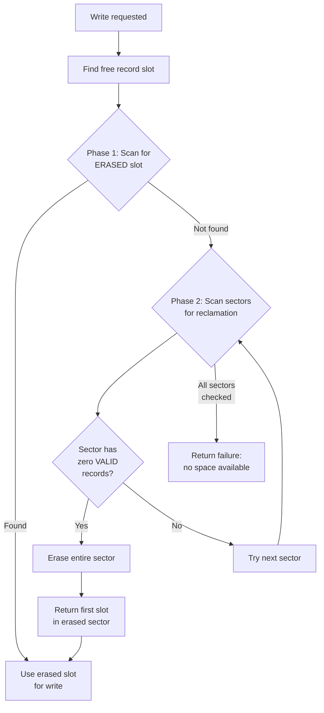
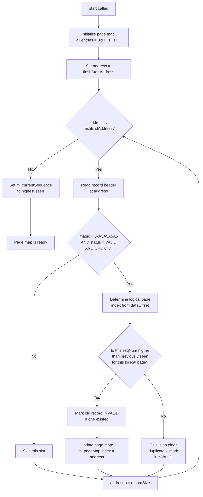

# KIT NV Flash Driver

## 1. Terminology

Before presenting diagrams and scenarios, we want to establish clear, unambiguous terms that we propose to use consistently throughout the design and its documentation.

| Term | Description |
|------|-------------|
| **NV Record** | The KIT NV driver's definition of a "page": the boundary and maximum amount of data that can be written in a single physical update of the NV storage. An NV Record consists of a Record Header followed by a Data Payload. The size of the Data Payload equals the configured `nvPageSize`. |
| **Flash Sector** | The smallest flash erasable unit. For the W25Q series this is 4096 bytes (4KB). All bytes within a sector must be erased together; individual bytes cannot be erased independently. |
| **Flash Page** | The largest flash "programming" size -- the maximum number of bytes that can be written to the flash device in a single program (write) operation. For the W25Q series this is 256 bytes. Note: A Flash Page is a property of the flash hardware and is intentionally a separate concept from an NV Record --- there is no requirement that they be the same size. |

### Relationship Between Terms

```
Flash Hardware Layer:
  Flash Sector (4KB)  = smallest erasable unit
  Flash Page (256B)   = largest single-program unit

KIT NV Driver Layer:
  NV Record           = Record Header (24B) + Data Payload (nvPageSize)
                        This is the atomic unit of NV storage management.
```

The KIT NV driver operates on NV Records. The underlying flash driver handles splitting writes that cross Flash Page boundaries internally. The NV driver does not need to be aware of the Flash Page size.

---

## 2. NV Record Structure

Each NV Record stored in flash consists of a fixed-size header followed by a data payload.

### Record Header Layout (24 bytes)

```
Byte Offset    Field          Size     Description
-----------    -----          ----     -----------
0x00           magic          4B       Magic number (0xA5A5A5A5) identifying a valid header
0x04           sequenceNum    4B       Monotonically increasing sequence number
0x08           dataOffset     4B       Starting offset of this record within the logical NV space
0x0C           dataLength     4B       Length of the data payload (equals nvPageSize)
0x10           crc32          4B       CRC32 over the preceding 16 bytes (magic through dataLength)
0x14           status         4B       Record lifecycle state (see below)
```

### Record Status Lifecycle

A record's status field transitions in one direction only. This ordering is chosen so that each transition only requires clearing bits (1 -> 0), which flash hardware allows without an erase cycle.

```
ERASED (0xFFFFFFFF)  -->  VALID (0x00000000)  -->  INVALID (0x55555555)

  ERASED:   Record slot is empty and available for writing.
            All bytes in the slot are 0xFF (factory/erased state).

  VALID:    Record contains current, valid data.
            Written when a new NV Record is programmed.

  INVALID:  Record is obsolete; a newer version of this data exists elsewhere.
            Written when a newer NV Record supersedes this one.
```

### Complete NV Record (Header + Data Payload)

```
+--------------------------------------------------+
| Record Header (24 bytes)                         |
|   magic | seqNum | dataOffset | dataLen | crc32  |
|   status                                         |
+--------------------------------------------------+
| Data Payload (nvPageSize bytes, e.g. 256 bytes)  |
|   [user data bytes ...........................]  |
+--------------------------------------------------+
  Total NV Record Size = 24 + nvPageSize
                       = 24 + 256 = 280 bytes (in this example)
```

---

## 3. Flash Sector Layout

A Flash Sector is the smallest erasable unit. NV Records are packed sequentially within each sector.

### How Many NV Records Fit in a Single Sector?

```
Given:
  Flash Sector Size   = 4096 bytes
  NV Record Size      = 280 bytes (24-byte header + 256-byte payload)

  Records per Sector  = floor(4096 / 280) = 14 records
  Unusable remainder  = 4096 - (14 * 280) = 4096 - 3920 = 176 bytes (wasted padding)
```

### Sector Diagram

The following diagram shows the internal layout of one Flash Sector containing 14 NV Record slots.

```
Flash Sector (4096 bytes / 4KB)
+========================================================================+
| Offset 0x000                                                           |
|  +------------------------------------------------------------------+  |
|  | NV Record Slot 0                                                 |  |
|  | [Header 24B] [Data Payload 256B]                                 |  |
|  | Offset: 0x000 - 0x117                            (280 bytes)     |  |
|  +------------------------------------------------------------------+  |
|  | NV Record Slot 1                                                 |  |
|  | [Header 24B] [Data Payload 256B]                                 |  |
|  | Offset: 0x118 - 0x22F                            (280 bytes)     |  |
|  +------------------------------------------------------------------+  |
|  | NV Record Slot 2                                                 |  |
|  | [Header 24B] [Data Payload 256B]                                 |  |
|  | Offset: 0x230 - 0x347                            (280 bytes)     |  |
|  +------------------------------------------------------------------+  |
|  | NV Record Slot 3                                                 |  |
|  | [Header 24B] [Data Payload 256B]                                 |  |
|  | Offset: 0x348 - 0x45F                            (280 bytes)     |  |
|  +------------------------------------------------------------------+  |
|  | NV Record Slot 4                                                 |  |
|  | [Header 24B] [Data Payload 256B]                                 |  |
|  | Offset: 0x460 - 0x577                            (280 bytes)     |  |
|  +------------------------------------------------------------------+  |
|  | NV Record Slot 5                                                 |  |
|  | [Header 24B] [Data Payload 256B]                                 |  |
|  | Offset: 0x578 - 0x68F                            (280 bytes)     |  |
|  +------------------------------------------------------------------+  |
|  | NV Record Slot 6                                                 |  |
|  | [Header 24B] [Data Payload 256B]                                 |  |
|  | Offset: 0x690 - 0x7A7                            (280 bytes)     |  |
|  +------------------------------------------------------------------+  |
|  | NV Record Slot 7                                                 |  |
|  | [Header 24B] [Data Payload 256B]                                 |  |
|  | Offset: 0x7A8 - 0x8BF                            (280 bytes)     |  |
|  +------------------------------------------------------------------+  |
|  | NV Record Slot 8                                                 |  |
|  | [Header 24B] [Data Payload 256B]                                 |  |
|  | Offset: 0x8C0 - 0x9D7                            (280 bytes)     |  |
|  +------------------------------------------------------------------+  |
|  | NV Record Slot 9                                                 |  |
|  | [Header 24B] [Data Payload 256B]                                 |  |
|  | Offset: 0x9D8 - 0xAEF                            (280 bytes)     |  |
|  +------------------------------------------------------------------+  |
|  | NV Record Slot 10                                                |  |
|  | [Header 24B] [Data Payload 256B]                                 |  |
|  | Offset: 0xAF0 - 0xC07                            (280 bytes)     |  |
|  +------------------------------------------------------------------+  |
|  | NV Record Slot 11                                                |  |
|  | [Header 24B] [Data Payload 256B]                                 |  |
|  | Offset: 0xC08 - 0xD1F                            (280 bytes)     |  |
|  +------------------------------------------------------------------+  |
|  | NV Record Slot 12                                                |  |
|  | [Header 24B] [Data Payload 256B]                                 |  |
|  | Offset: 0xD20 - 0xE37                            (280 bytes)     |  |
|  +------------------------------------------------------------------+  |
|  | NV Record Slot 13                                                |  |
|  | [Header 24B] [Data Payload 256B]                                 |  |
|  | Offset: 0xE38 - 0xF4F                            (280 bytes)     |  |
|  +------------------------------------------------------------------+  |
|  | Unused Padding                                                   |  |
|  | Offset: 0xF50 - 0xFFF                            (176 bytes)     |  |
|  +------------------------------------------------------------------+  |
| Offset 0xFFF                                                          |
+========================================================================+
```

---

## 4. Full NV Region Layout

The NV region is the portion of flash that we propose to dedicate to NV storage. It spans multiple contiguous Flash Sectors.

### Example Configuration

```
NV Region:          128KB (0x000000 - 0x01FFFF)
Flash Sector Size:  4KB
Number of Sectors:  32
NV Records/Sector:  14
Total NV Records:   32 * 14 = 448 record slots

Logical NV Size:    4KB (presented to the application)
NV Page Size:       256 bytes
Logical Pages:      4096 / 256 = 16 logical pages
```

### Region Diagram

```
NV Flash Region (128KB)
+==============================================+
| Sector 0:   0x000000 - 0x000FFF  (4KB)      |
|   Record slots 0..13                         |
+----------------------------------------------+
| Sector 1:   0x001000 - 0x001FFF  (4KB)      |
|   Record slots 14..27                        |
+----------------------------------------------+
| Sector 2:   0x002000 - 0x002FFF  (4KB)      |
|   Record slots 28..41                        |
+----------------------------------------------+
| Sector 3:   0x003000 - 0x003FFF  (4KB)      |
|   Record slots 42..55                        |
+----------------------------------------------+
|           ... (sectors 4 through 30) ...     |
+----------------------------------------------+
| Sector 31:  0x01F000 - 0x01FFFF  (4KB)      |
|   Record slots 434..447                      |
+==============================================+

Total capacity: 448 record slots for 16 logical pages
Over-provisioning ratio: 448 / 16 = 28:1
```

### In-Memory Page Map

We propose maintaining a small in-memory array that maps each logical page to the physical flash address of its most recent valid NV Record.

```
Logical Page Index:   0       1       2      ...     15
                    +-------+-------+-------+     +--------+
m_pageMap[]:        | addr  | addr  | addr  | ... | addr   |
                    +-------+-------+-------+     +--------+
                      |       |       |              |
                      v       v       v              v
                    Phys.   Phys.   Phys.          Phys.
                    addr    addr    addr           addr
                    in      in      in             in
                    flash   flash   flash          flash

Entry = 0xFFFFFFFF means no valid data exists for that logical page.
```

---

## 5. Sequential Write Scenario

This scenario traces three sequential writes to the same logical page to illustrate the Read-Modify-Write mechanism and how NV Records accumulate.

### Configuration

```
nvPageSize = 256 bytes
NV Record Size = 280 bytes (24-byte header + 256-byte data)
```

### Write #1: Write 10 bytes at offset 0

```
User Request:  write(offset=0, data=[01 02 03 04 05 06 07 08 09 0A], length=10)
Logical Page:  0 (offset 0 / 256 = 0)

Step 1: No existing data for page 0 (m_pageMap[0] = 0xFFFFFFFF)
        Fill buffer with 0xFF (erased state)

Step 2: Merge user data into buffer at offset 0
        Buffer: [01 02 03 04 05 06 07 08 09 0A FF FF FF ... FF]
                 ^^^^^^^^^^^^^^^^^^^^^^^^^^^^^^^^^
                 10 bytes of user data              remaining 246 bytes = 0xFF

Step 3: Find free record slot -> 0x000000 (first slot in Sector 0)

Step 4: Write NV Record to flash
        Address 0x000000: Header (magic, seq=1, dataOffset=0, status=VALID)
        Address 0x000018: Data Payload (256 bytes from buffer)

Step 5: Update page map
        m_pageMap[0] = 0x000000
```

**Sector 0 after Write #1:**

```
Sector 0
+---------------------------------------------------------------+
| Slot 0: [HDR seq=1 VALID  ] [01 02 03..0A FF FF..FF]         |
| Slot 1: [ERASED ........................................]     |
| Slot 2: [ERASED ........................................]     |
|   ...                                                         |
| Slot 13:[ERASED ........................................]     |
+---------------------------------------------------------------+
```

### Write #2: Write 2 bytes at offset 0

```
User Request:  write(offset=0, data=[B2 C4], length=2)
Logical Page:  0 (same page)

Step 1: Page 0 exists at 0x000000 -> read existing 256-byte payload
        Buffer: [01 02 03 04 05 06 07 08 09 0A FF FF FF ... FF]

Step 2: Merge user data into buffer at offset 0
        Buffer: [B2 C4 03 04 05 06 07 08 09 0A FF FF FF ... FF]
                 ^^^^^
                 2 new bytes    remaining bytes PRESERVED from Write #1

Step 3: Find free record slot -> 0x000118 (next slot in Sector 0)

Step 4: Write NV Record to flash
        Address 0x000118: Header (magic, seq=2, dataOffset=0, status=VALID)
        Address 0x000130: Data Payload (256 bytes from merged buffer)

Step 5: Mark old record at 0x000000 as INVALID
        Write 0x55555555 to status field at 0x000014

Step 6: Update page map
        m_pageMap[0] = 0x000118
```

**Sector 0 after Write #2:**

```
Sector 0
+---------------------------------------------------------------+
| Slot 0: [HDR seq=1 INVALID] [01 02 03..0A FF FF..FF]         |  <- obsolete
| Slot 1: [HDR seq=2 VALID  ] [B2 C4 03..0A FF FF..FF]         |  <- current
| Slot 2: [ERASED ........................................]     |
|   ...                                                         |
| Slot 13:[ERASED ........................................]     |
+---------------------------------------------------------------+
```

### Write #3: Write 3 bytes at offset 5

```
User Request:  write(offset=5, data=[DD EE FF], length=3)
Logical Page:  0 (offset 5 / 256 = 0, offsetInPage = 5)

Step 1: Page 0 exists at 0x000118 -> read existing 256-byte payload
        Buffer: [B2 C4 03 04 05 06 07 08 09 0A FF FF FF ... FF]

Step 2: Merge user data into buffer at offset 5
        Buffer: [B2 C4 03 04 05 DD EE FF 09 0A FF FF FF ... FF]
                                   ^^^^^^^^^
                                   3 new bytes at position 5-7

Step 3: Find free record slot -> 0x000230 (next slot in Sector 0)

Step 4: Write NV Record to flash
        Address 0x000230: Header (magic, seq=3, dataOffset=0, status=VALID)
        Address 0x000248: Data Payload (256 bytes from merged buffer)

Step 5: Mark old record at 0x000118 as INVALID

Step 6: Update page map
        m_pageMap[0] = 0x000230
```

**Sector 0 after Write #3:**

```
Sector 0
+---------------------------------------------------------------+
| Slot 0: [HDR seq=1 INVALID] [01 02 03..0A FF FF..FF]         |  <- obsolete
| Slot 1: [HDR seq=2 INVALID] [B2 C4 03..0A FF FF..FF]         |  <- obsolete
| Slot 2: [HDR seq=3 VALID  ] [B2 C4 03 04 05 DD EE FF 09..]  |  <- current
| Slot 3: [ERASED ........................................]     |
|   ...                                                         |
| Slot 13:[ERASED ........................................]     |
+---------------------------------------------------------------+

Page Map:
  m_pageMap[0] = 0x000230  (Slot 2 in Sector 0)
```

### Read: Read 10 bytes from offset 0

```
User Request:  read(offset=0, buffer, length=10)
Logical Page:  0

Step 1: Lookup m_pageMap[0] = 0x000230
Step 2: Read address = 0x000230 + 24 (header) + 0 (offset) = 0x000248
Step 3: Read 10 bytes from 0x000248

Result: [B2 C4 03 04 05 DD EE FF 09 0A]
```

---

## 6. Scatter Write Scenario

This scenario traces writes to different logical pages to show how NV Records for different pages intermingle within the same sectors.

### Write Sequence

```
Write A:  write(offset=0,   data=[AA BB CC DD], length=4)    -> Logical Page 0
Write B:  write(offset=256, data=[11 22 33],    length=3)    -> Logical Page 1
Write C:  write(offset=512, data=[EE FF],       length=2)    -> Logical Page 2
Write D:  write(offset=0,   data=[99],          length=1)    -> Logical Page 0 (update)
Write E:  write(offset=256, data=[44 55 66 77], length=4)    -> Logical Page 1 (update)
```

### Sector Layout After All Five Writes

```
Sector 0
+---------------------------------------------------------------+
| Slot 0: [HDR seq=1 INVALID] Page 0: [AA BB CC DD FF..FF]     |  <- obsolete (superseded by D)
| Slot 1: [HDR seq=2 INVALID] Page 1: [11 22 33 FF FF..FF]     |  <- obsolete (superseded by E)
| Slot 2: [HDR seq=3 VALID  ] Page 2: [EE FF FF FF FF..FF]     |  <- current
| Slot 3: [HDR seq=4 VALID  ] Page 0: [99 BB CC DD FF..FF]     |  <- current (byte 0 updated)
| Slot 4: [HDR seq=5 VALID  ] Page 1: [44 55 66 77 FF..FF]     |  <- current (bytes 0-3 updated)
| Slot 5: [ERASED ........................................]     |
|   ...                                                         |
| Slot 13:[ERASED ........................................]     |
+---------------------------------------------------------------+
```

### Page Map After All Five Writes

```
m_pageMap[0]  = 0x000348  (Slot 3 -- most recent version of page 0)
m_pageMap[1]  = 0x000460  (Slot 4 -- most recent version of page 1)
m_pageMap[2]  = 0x000230  (Slot 2 -- only version of page 2)
m_pageMap[3]  = 0xFFFFFFFF (no data written)
  ...
m_pageMap[15] = 0xFFFFFFFF (no data written)
```

### Key Observations

1. **NV Records for different logical pages share the same sector.** There is no fixed mapping of "logical page X always goes to sector Y." NV Records are appended to the next available slot regardless of which logical page they belong to.
2. **Old and new versions coexist.** Slot 0 (old page 0) and Slot 3 (new page 0) both exist in Sector 0. The page map always points to the newest version. The old version is marked INVALID.
3. **Sequence numbers are global, not per-page.** Each write operation increments a single global counter. This allows unambiguous ordering during startup recovery.

---

## 7. Sector Reclamation

When all record slots in the NV region are consumed, the driver needs to reclaim space. We propose a two-phase approach: first try to find already-erased slots, and only if none exist, erase a sector that contains no VALID records.

### Preconditions for Sector Erasure

A sector can ONLY be erased when it contains **zero** VALID records. All records in the sector must be either ERASED or INVALID.

### Reclamation Walkthrough

#### Starting State: Sector Full of Obsolete Records

Suppose after many writes, Sector 0 looks like this:

```
Sector 0 (all slots consumed, no ERASED slots remain)
+---------------------------------------------------------------+
| Slot 0:  [HDR seq=1  INVALID] Page 0 (old)                   |
| Slot 1:  [HDR seq=2  INVALID] Page 1 (old)                   |
| Slot 2:  [HDR seq=3  INVALID] Page 2 (old)                   |
| Slot 3:  [HDR seq=4  INVALID] Page 0 (old)                   |
| Slot 4:  [HDR seq=5  INVALID] Page 1 (old)                   |
| Slot 5:  [HDR seq=9  INVALID] Page 3 (old)                   |
| Slot 6:  [HDR seq=10 INVALID] Page 0 (old)                   |
| Slot 7:  [HDR seq=11 INVALID] Page 4 (old)                   |
| Slot 8:  [HDR seq=12 INVALID] Page 1 (old)                   |
| Slot 9:  [HDR seq=14 INVALID] Page 0 (old)                   |
| Slot 10: [HDR seq=15 INVALID] Page 2 (old)                   |
| Slot 11: [HDR seq=16 INVALID] Page 5 (old)                   |
| Slot 12: [HDR seq=20 INVALID] Page 0 (old)                   |
| Slot 13: [HDR seq=21 INVALID] Page 3 (old)                   |
+---------------------------------------------------------------+
All 14 slots are INVALID.  Current valid records for pages 0-5
reside in other sectors.
```

#### Step 1: Driver Attempts a Write

```
User calls: write(offset=0, data=[...], length=10)

The driver calls findFreePageAddress().
  Phase 1 (find erased slot): Scans all sectors...
    Sector 0:  No ERASED slots (all INVALID)
    Sector 1:  No ERASED slots
    ...
    Sector 31: No ERASED slots
  Phase 1 result: No free slot found.
```

#### Step 2: Phase 2 -- Sector Reclamation

```
  Phase 2 (reclaim a sector): Scans sectors for reclamation candidates...
    Sector 0:  Check all 14 slots -> all are INVALID -> CANDIDATE

  Erase Sector 0:
    Flash hardware erases all 4096 bytes to 0xFF
    m_eraseCount incremented

  Return address 0x000000 (first slot in freshly erased sector)
```

#### Step 3: After Erasure

```
Sector 0 (freshly erased -- all slots available)
+---------------------------------------------------------------+
| Slot 0:  [ERASED ........................................]    |  <- returned to caller
| Slot 1:  [ERASED ........................................]    |
| Slot 2:  [ERASED ........................................]    |
|   ...                                                         |
| Slot 13: [ERASED ........................................]    |
+---------------------------------------------------------------+
14 new record slots are now available for writing.
```

#### Step 4: Write Proceeds Normally

The write operation now continues using the freshly erased Slot 0 at address 0x000000, performing the standard Read-Modify-Write sequence.

### Reclamation Flow Diagram



### When Can a Sector NOT Be Reclaimed?

A sector that still contains at least one VALID record cannot be erased, because erasing would destroy that valid data.

```
Sector X (NOT reclaimable)
+---------------------------------------------------------------+
| Slot 0:  [HDR INVALID] Page 0 (old)                          |
| Slot 1:  [HDR INVALID] Page 1 (old)                          |
| Slot 2:  [HDR VALID  ] Page 2 (current!) <-- BLOCKS ERASURE  |
| Slot 3:  [HDR INVALID] Page 3 (old)                          |
|   ...                                                         |
| Slot 13: [HDR INVALID] Page 0 (old)                          |
+---------------------------------------------------------------+
Sector cannot be erased because Slot 2 holds the current valid
data for logical page 2.
```

To make this sector reclaimable, the valid record in Slot 2 would need to be superseded first: the application would need to write new data to logical page 2, causing the driver to write a new NV Record elsewhere and mark Slot 2 as INVALID.

---

## 8. Startup: Building the Page Map

On power-up or reset, the in-memory page map does not exist. We propose that the driver reconstruct it by scanning all NV Records in flash.

### Startup Scan Algorithm



### What the Scan Produces

After scanning, the driver has:

1. **m_pageMap[]**: Each entry points to the physical address of the most recent VALID NV Record for that logical page (or 0xFFFFFFFF if the page has never been written).
2. **m_currentSequence**: Set to the highest sequence number seen during the scan. The next write would use m_currentSequence + 1.
3. **Cleanup**: Any older duplicate records found during the scan are marked INVALID, ensuring sectors with only obsolete records can be reclaimed.

---

## 9. Cross-Page Write Scenario

When a write spans two or more logical pages, the driver handles each affected page independently in sequence.

### Example: Write 20 bytes starting at offset 250

```
nvPageSize = 256 bytes

Offset 250 falls in:  Logical Page 0 (offset 250, remaining in page = 6 bytes)
Offset 256 falls in:  Logical Page 1 (offset 0, remaining write = 14 bytes)

The driver would process this as two separate NV Record writes:

  Sub-write A: Page 0
    offsetInPage = 250
    bytesThisPage = min(256 - 250, 20) = 6
    Read existing page 0 data -> merge 6 bytes at position 250 -> write new NV Record

  Sub-write B: Page 1
    offsetInPage = 0
    bytesThisPage = 20 - 6 = 14
    Read existing page 1 data -> merge 14 bytes at position 0 -> write new NV Record
```

```
Logical NV Address Space (application view):
  Page 0                        Page 1
  [0 ................... 255]   [256 ................ 511]
                    |<--6B-->|<--14B-->|
                    ^                  ^
                offset=250         offset=269
                    |______ 20 bytes total ______|
```

---

## 10. End-to-End Address Translation

This section traces one complete read operation through all layers of the address translation.

### Scenario: Read 4 bytes from offset 260

```
Step 1: Logical Offset -> Logical Page Index
  pageIndex   = 260 / 256 = 1
  offsetInPage = 260 % 256 = 4

Step 2: Logical Page Index -> Physical Address (page map lookup)
  m_pageMap[1] = 0x001118  (for this example)

Step 3: Physical Address -> Flash Read
  dataAddress = 0x001118           (NV Record start)
              + 24                 (skip Record Header)
              + 4                  (offsetInPage)
              = 0x001134

  flashDriver.read(0x001134, buffer, 4)
```

```
  Logical View:                      Physical View:
  +----------+----------+           Flash @ 0x001118:
  | Page 0   | Page 1   |           +------------------+------------------+
  |          |   ^      |           | Record Header    | Data Payload     |
  |          | off=4   |           | (24 bytes)       | (256 bytes)      |
  +----------+----------+           +------------------+--+---------------+
                |                                      |  ^
                |                                      |  offset 4
                +---------- maps to ------------------>+  = 0x001134
```

---

## 11. Configuration Sizing Examples

The following table provides sizing estimates for two hypothetical application data sizes, using the architecture described in this document.

### Assumptions

```
nvPageSize          = 256 bytes
Record Header       = 24 bytes
NV Record Size      = 280 bytes (24 + 256)
Flash Sector Size   = 4,096 bytes (4KB)
Records per Sector  = floor(4096 / 280) = 14
Page map entry      = 4 bytes (uint32_t per logical page)
Over-provisioning   = ~28:1 (record slots to logical pages)
SPI clock           = 10 MHz
Scan time per page  = ~35 us (header read + overhead)
```

### Sizing Table

| Parameter | 4KB Application Data | 128KB Application Data |
|-----------|----------------------|------------------------|
| Logical NV Size | 4,096 bytes | 131,072 bytes |
| Logical Pages | 16 | 512 |
| **Physical Flash Required** | **128KB** (32 sectors, 448 record slots) | **4MB** (1,024 sectors, 14,336 record slots) |
| Over-provisioning Ratio | 28:1 (448 / 16) | 28:1 (14,336 / 512) |
| **Page Map RAM** | **64 bytes** (16 x 4 bytes) | **2,048 bytes (2KB)** (512 x 4 bytes) |
| Total Record Slots | 448 | 14,336 |
| **Startup Scan Time** | **~16-25 ms** (448 pages x ~35 us) | **~500-625 ms** (14,336 pages x ~35 us) |
| Erase Frequency (approx.) | ~1 erase per 10-14 writes | ~1 erase per 10-14 writes |
| Wasted Padding per Sector | 176 bytes | 176 bytes |
| Total Wasted Padding | 5,632 bytes (32 x 176) | 179,200 bytes (1,024 x 176) |

### Observations

1. **Physical flash scales linearly with application data.** Doubling the logical NV size doubles the physical flash required (at the same over-provisioning ratio).
2. **Page map RAM is small.** Even for 128KB of application data, the page map requires only 2KB of RAM.
3. **Startup time scales linearly with physical flash size.** The 128KB application data example requires scanning 32 times more record slots than the 4KB example, resulting in a proportionally longer startup.
4. **Erase frequency is independent of data size.** The over-provisioning ratio determines erase frequency, not the absolute data size. Both examples use the same ratio and therefore exhibit similar erase behavior.
5. **The 128KB example requires a larger flash device.** A W25Q128 (16MB) can accommodate both examples. A W25Q32 (4MB) would be the minimum device for the 128KB application data case.

---

## 12. Summary of Diagrams

| Diagram | What It Shows |
|---------|---------------|
| NV Record Structure (Section 2) | Header fields and data payload layout |
| Flash Sector Layout (Section 3) | How 14 NV Records pack into one 4KB sector |
| Full NV Region Layout (Section 4) | 32 sectors forming the 128KB NV region |
| Sequential Write (Section 5) | Three writes to same page showing Read-Modify-Write |
| Scatter Write (Section 6) | Writes to different pages intermingled in one sector |
| Sector Reclamation (Section 7) | How and when sectors are erased and reused |
| Startup Scan (Section 8) | How the page map is rebuilt from flash on power-up |
| Cross-Page Write (Section 9) | A single write spanning two logical pages |
| Address Translation (Section 10) | End-to-end trace from logical offset to physical flash read |
| Configuration Sizing (Section 11) | Physical flash, RAM, and startup time for 4KB and 128KB examples |
