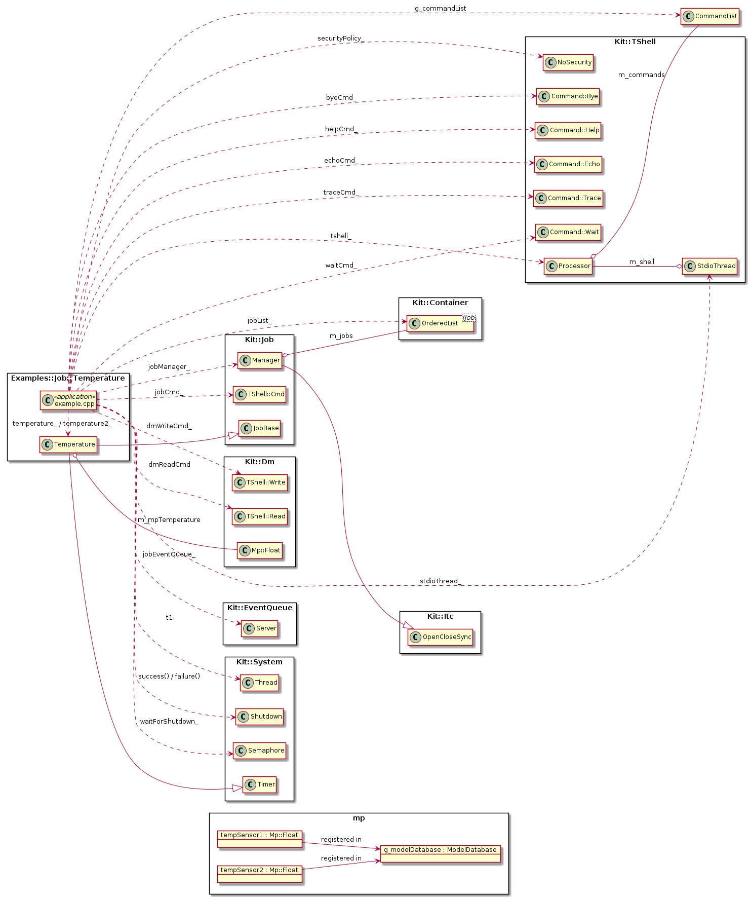

# Projects.Examples.Job.Temperature
@namespace Examples::Job::Temperature

\brief Implements a simple example of a Kit::IJob that samples and displays temperature

The concrete IJob instance polls a model point for a temperature value and
periodically writes the value to the trace output. The IJob also collects some
metrics and has the option to display temperature in degrees Fahrenheit or 
Celsius.

**NOTE**: The analog value is 'mocked', i.e. the MP for the value exists - but
          there is no underlying driver that samples an analog input.  However,
          the developer can manipulate the MP's value via the `dmw` console
          command. For example: `dmw {name:"tempSensor1",val:22.42}`

## Class Diagram

## See Also

- @ref Kit::Dm "Kit::Dm namespace documentation"

## Implementation

- Root source directory: [projects/Examples/Job/Temperature](https://github.com/Integerfox/kit.core/blob/main/projects/Examples/Job/Temperature)
- Build directory: [projects/Examples/Job/Temperature/_0build](https://github.com/Integerfox/kit.core/blob/main/projects/Examples/Job/Temperature/_0build)
- Build Targets:
  - Host: Linux, Windows
  - NUCLEO-F413ZH w/FreeRTOS
