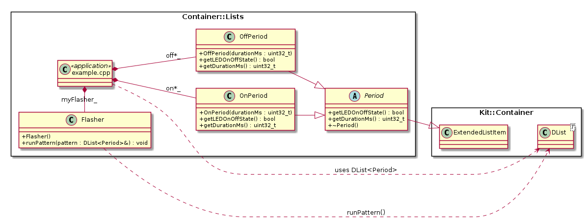

# Projects.Examples.Container.List {#projects_examples_container_list}

\brief Singly and Doubly linked lists that contain unlimited number of items and
       uses no dynamic memory.

The linked lists are type safe that can contain **any** class type - as long as
the class's inheritance tree includes `ListItem` for a singly linked list
(`SList<>`) or `ExtendedListItem` for a doubly linked list (`DList<>`).

The example application only uses a doubly linked list.  The semantic of a
doubly and singly linked lists are the same (i.e. same set of methods).  The
different between the two list types - is that the doubly linked list is more
run-time efficient with respect to removing and inserting items from/in the
'middle' of the list than singly linked list.  This efficiency comes at the
expense of more RAM usage **per** item.

The example application contains a `Flasher` class that accepts a `DList<Period>`
reference where the list contains N on/off periods that is used to flash a LED.

## Details, Constraints, Requirements

- The linked lists are type safe that can contain **any** class type - as long
  as the class's inheritance tree includes `ListItem` for a singly linked list
  (`SList<>`) or `ExtendedListItem` for a doubly linked list (`DList<>`).

- Contained items in a linked list must homogenous, i.e. a single type. However,
  if the 'item' type is abstract or parent class - concrete child classes of
  the 'item' parent class can be contained in the list.

- The link list use *intrusive* semantics, i.e. the items stored in the list
  must be designed to be contained in a list.  This intrusive semantics is what
  allows the linked lists contain any number of instance, i.e. if the item
  exists - it can always be placed in a list.

- At any given time, a list item can be contained in **at most one** list.

- A class that inherits from `ListItem` can only be contained within a
  `SList<>`.  A class that inherits from `ExtendedListItem` can be contained
  either in a `SList<>` or `DList<>`.

- The link list are **not** inherently thread safe.  If thread safety is needed
  the recommendation is to create a *wrapper* class to provide the necessary
  thread safe.  See the [`RingBufferMT`](https://github.com/Integerfox/kit.core/blob/main/src/Kit/Container/RingBufferMT.h)
  class as an example of implementing a thread-safe wrapper.

## Class Diagram

## See Also

- @ref Kit::Container "Kit::Container namespace documentation"

## Implementation

- Root source directory: [projects/examples/Container/Lists](https://github.com/Integerfox/kit.core/blob/main/projects/examples/Container/Lists)
- Build directory: [projects/examples/Container/Lists/_0build](https://github.com/Integerfox/kit.core/blob/main/projects/examples/Container/Lists/_0build)
- Build Targets:
  - Host: Linux, Windows
  - NUCLEO-F413ZH w/FreeRTOS
