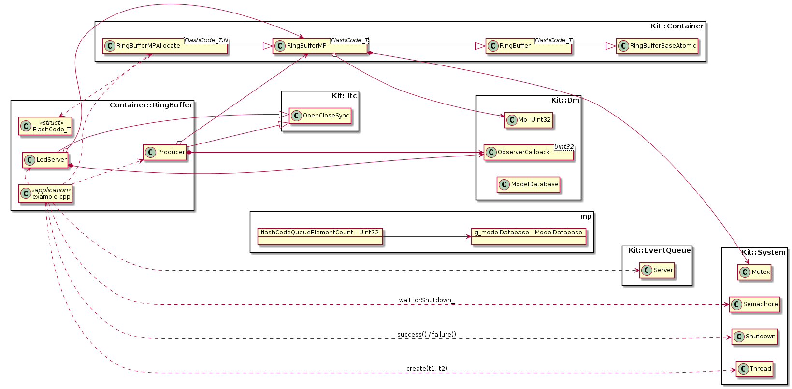

# Projects.Examples.Container.RingBuffer {#projects_examples_container_ringbuffer}

\brief Ring Buffer with change notifications when items are added-to and
       removed-from the buffer.

The example application contains a data producer (`Producer`) that adds elements
(i.e LED Flash codes) to the `RingBufferMP` instance.  A consumer class (`LedServer`)
drains all elements when it receives change notification that the data has
been added to the Ring Buffer.  The drain elements/flash-codes are used to
drive the board's debug LED.

## Details, Constraints, Requirements

- The Ring Buffer classes are type safe they can contain **any** data type, i.e.
  primitive C/C++ types and structs/classes.

- Ring Buffers have a fixed size (set when an instance is constructed)

- The implementation uses 'empty slot' to represent a empty/full buffer.  This
  means that Ring Buffer created with memory for N items - can only stored N-1
  items

- The Ring Buffer holds copies of the data items, i.e. items a copied into/from
  the buffer.

- The 'basic' Ring Buffer is not thread safe.  However there exists two thread
  safe version of the Ring Buffer.  One - `RingBufferMT` is wrapper to basic
  RingBuffer class that uses mutexes for enforcing critical sections.  The `RingBufferMP`
  class is very similar to `RingBufferMT` in that uses a mutex, however the
  `RingBufferMT` class adds thread-safe Model Point that maintains the contained
  items count.  This MP is used to generate change notification when the buffer'
  items count changes.

## Class Diagram

## See Also

- @ref Kit::Container "Kit::Container namespace documentation"
- @ref Kit::Dm        "Kit::Dm namespace documentation"

## Implementation

- Root source directory: [projects/examples/Container/RingBuffer](https://github.com/Integerfox/kit.core/blob/main/projects/Container/RingBuffer)
- Build directory: [projects/examples/Container/RingBuffer/_0build](https://github.com/Integerfox/kit.core/blob/main/projects/Container/RingBuffer/_0build)
- Build Targets:
  - Host: Linux, Windows
  - NUCLEO-F413ZH w/FreeRTOS
