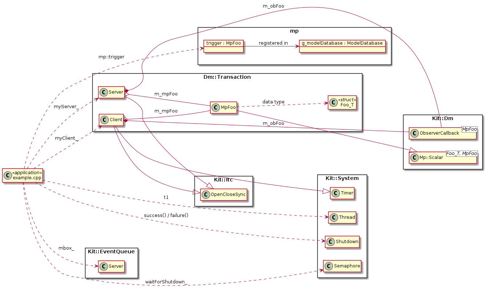

# Projects.Examples.Dm.Transaction {#projects_examples_dm_transaction}

\brief Using Data Model Change notification for Inter-Thread-Communication (ITC).

The directory contains a example application that illustrate how to use a model
point for an **asynchronous** 'request-with-response' transaction.  A transaction
consists of a client triggering/requesting an action from a server.  The server
when notified - consumes the requests, carries out its actions, and then triggers
a 'response' that returns a success/fail of the action.  The transaction is done
using a single model point instance.  

The client and server instances can be separate threads or the same thread.

## Why?

Why implement a Client/Server transaction this way?  When the client/server
instances are in different threads - using a model point is a relatively "painless"
way to implement the transaction vs. other ITC approaches (e.g. ITC messaging).

Does this mean it is good idea?  Sometimes yes, sometimes no.  It all depends
on the specific use case/requirements.

## Details, Constraints, Requirements

- The Data Model's change notification mechanism is used by both the client
  and server widgets
  - This requires both the client and server widgets to execute in an Event
    thread context.
  - Also requires that both the client and server widgets inherit/uses the
    `Kit::Itc::OpenCloseSync` class because registering/canceling DM change
    notifications **must** be done in the same thread - and that thread is
    thread context for which the notification callback executes in.

- The application is responsible for ensuring that there is at most **one**
  transaction in-flight transaction at any given time.

- The example includes creating a new model point that a data structure.
  - **Note**: in the example, the structure is used to separate the 'input'
    and 'results' data for the transaction.  However, the transaction pattern
    does not require it.  For example - a minimal transaction pattern can be
    done with a `Bool` MP where transition to `true` triggers the server/action,
    and the server returns "success" by setting the MP to invalid and returns
    to "fail" by setting the MP to `false`

## Class Diagram

## Implementation

- Root source directory: [projects/examples/Dm/Transaction](https://github.com/Integerfox/kit.core/blob/main/projects/examples/Dm/Transaction)
- Build directory: [projects/examples/Dm/Transaction/_0build](https://github.com/Integerfox/kit.core/blob/main/projects/examples/Dm/Transaction/_0build)
- Build Targets:
  - Host: Linux, Windows
  - NUCLEO-F413ZH w/FreeRTOS

