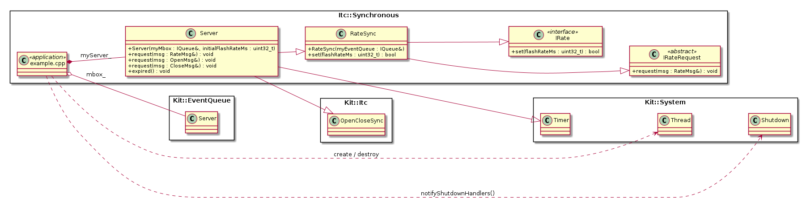

# Projects.Examples.Itc.Asynchronous {#projects_examples_itc_asynchronous}

\brief Asynchronous message based Inter-Thread-Communication (ITC).

The directory contains a example application on how to use KIT's asynchronous
ITC messaging.  The example contains server widget.  The server widget is
responsible for flashing a LED a specific rate.  The Client widget use asynchronous
ITC message to set the flash rate.

**NOTE:** The example is built on-top of the ITC Synchronous example it that
          re-uses the example's [IRateRequest](https://github.com/Integerfox/kit.core/blob/main/projects/examples/Itc/Asynchronous/IRateRequest.h)
          class

## Use cases

The most common use is to use asynchronous ITC messaging is when the client has
asynchronous behavior (i.e. its behavior is inherently a state machine) or when
the client cannot block executing while waiting on event X to happen.

## Details, Constraints, Requirements

- When using asynchronous ITC messages - the message client and server **can**
  be the same thread.

- Both the client and server **must** executing in event-loop based thread(s)

- A ITC request message class must be created. See [IRateRequest.h](https://github.com/Integerfox/kit.core/blob/main/projects/examples/Itc/Synchronous/IRateRequest.h).

- A ITC response message class must be created and it references the request class.
  See [IRateResponse.h](https://github.com/Integerfox/kit.core/blob/main/projects/examples/Itc/Asynchronous/IRateResponse.h).
  - The Request and Response messages _share_ the same payload which is defined
    in the Request message class.

- The _server_ has **no** knowledge of the synchronous/asynchronous semantics
  of the messaging.  It is the **client's** usage that determine the semantics
  of the ITC message.  This done by which concrete [IReturnHandler](https://github.com/Integerfox/kit.core/blob/main/src/Kit/Itc/IReturnHandler.h)
  instance is used when the ITC message is created.

- Both the Client and Server widgets use synchronous ITC for initialization and
  shutdown.

- The [Server.h](https://github.com/Integerfox/kit.core/blob/main/projects/examples/Itc/Synchronous/Server.h)
  and [IRateRequest.h](https://github.com/Integerfox/kit.core/blob/main/projects/examples/Itc/Synchronous/IRateRequest.h)
  classes from the Itc/Synchronous example are re-used without modification or extensions.

**NOTE**: The example also utilizes sending an argument/data via the synchronous
          ITC open message.

## Class Diagram

## See Also

- @ref Kit::Itc "Kit::Itc namespace documentation"
- @ref projects_examples_itc_synchronous "Synchronous ITC example"

## Implementation

- Root source directory: [projects/examples/Itc/Asynchronous](https://github.com/Integerfox/kit.core/blob/main/projects/examples/Itc/Asynchronous)
- Build directory: [projects/examples/Itc/Asynchronous/_0build](https://github.com/Integerfox/kit.core/blob/main/projects/examples/Itc/Asynchronous/_0build)
- Build Targets:
  - Host: Linux, Windows
  - NUCLEO-F413ZH w/FreeRTOS
