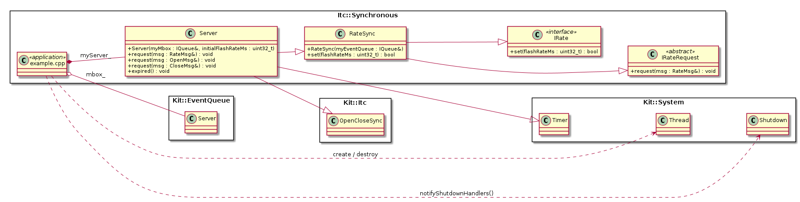

# Projects.Examples.Itc.Synchronous {#projects_examples_itc_synchronous}

\brief Synchronous message based Inter-Thread-Communication (ITC).

The directory contains a example application on how to use KIT's synchronous
ITC messaging.  The example contains server widget.  The server widget is
responsible for flashing a LED a specific rate.  The application's main thread
uses a synchronous ITC message to set the flash rate.

**NOTE:** The server widget also uses the KIT open/close synchronous ITC messages
          for its software timer initialization and shutdown.

## Use cases

The most common use is to use synchronous ITC messaging for doing in-thread
initialization and shutdown of widgets (i.e. see the [OpenCloseSync.h](https://github.com/Integerfox/kit.core/blob/main/src/Kit/Itc/OpenCloseSync.h)). In this use case the 'main application' thread is only used to start and shutdown
the application's widget - so there is no/minimal danger of deadlock. In addition
the synchronous nature of the messages allows the widgets to initialized/shutdown
sequentially.

Another common use case when there is dedicated thread that provides a single
service.  For example a single thread that is responsible for all reads and
writes to persistent storage.

## Details, Constraints, Requirements

- When using synchronous ITC messages - the message client and server **must**
  be in different threads.  Another constraint/concern is when (or if) a *server*
  issues a synchronous ITC message request when processing a received ITC message.
  This opens the possibility of dead-lock occurring. This is important because
  synchronous ITC messaging can be *wrapped* or *abstracted* as a simple function
  call. Or said another way while synchronous ITC message is simpler/easier than
  asynchronous ITC messaging, however it is **dangerous** and requires *guard
  rails*.
  - It is recommended that your SW architecture define conventions and/or rules
    for when synchronous ITC is okay to be used.

- One advantage of synchronous ITC messaging is that the client does **not** have
  be executing in event-loop based thread, i.e. the client can be executing in a
  application defined IRunnable object instead of [IQueue](https://github.com/Integerfox/kit.core/blob/main/src/Kit/EventQueue/IQueue.h)
  instance/thread.

- A ITC request message class must be created. See [IRateRequest.h](https://github.com/Integerfox/kit.core/blob/main/projects/examples/Itc/Synchronous/IRateRequest.h)

- It is recommended to create a separate class that abstracts the synchronous ITC
  messaging as a function call.  See [RateSync.h](https://github.com/Integerfox/kit.core/blob/main/projects/examples/Itc/Synchronous/RateSync.h)

- It is recommended to have a single exit point from the message request
  function - that calls returnToSender() on the message - to ensure that the
  message transaction completes.
  
- The *server* has **no** knowledge of the synchronous/asynchronous semantics
  of the messaging.  It is the **client's** usage that determine the semantics
  of the ITC message.  This done by which concrete [IReturnHandler](https://github.com/Integerfox/kit.core/blob/main/src/Kit/Itc/IReturnHandler.h)
  instance is used when the ITC message is created.

## Class Diagram

## See Also

- @ref Kit::Itc "Kit::Itc namespace documentation"

## Implementation

- Root source directory: [projects/examples/Itc/Synchronous](https://github.com/Integerfox/kit.core/blob/main/projects/examples/Itc/Synchronous)
- Build directory: [projects/examples/Itc/Synchronous/_0build](https://github.com/Integerfox/kit.core/blob/main/projects/examples/Itc/Synchronous/_0build)
- Build Targets:
  - Host: Linux, Windows
  - NUCLEO-F413ZH w/FreeRTOS
