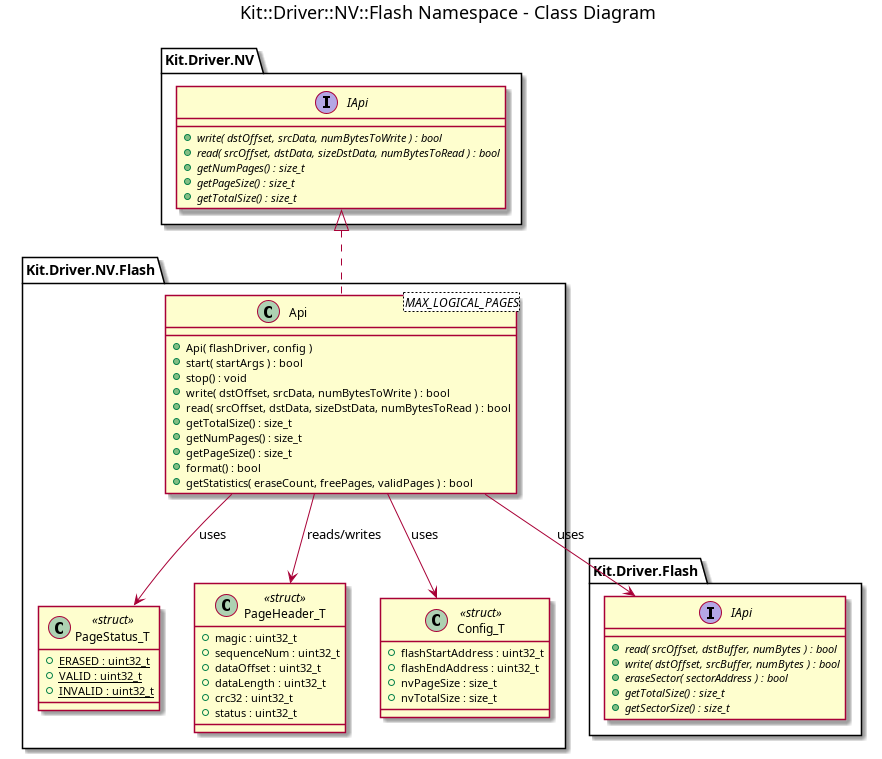
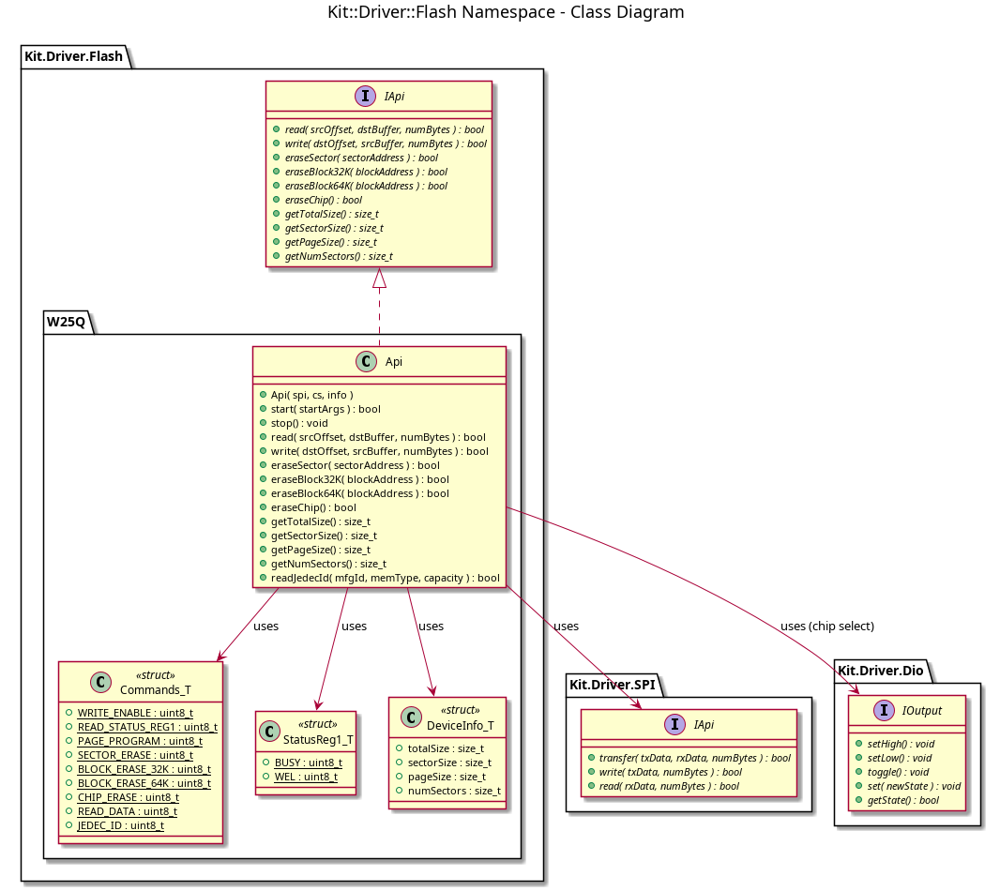
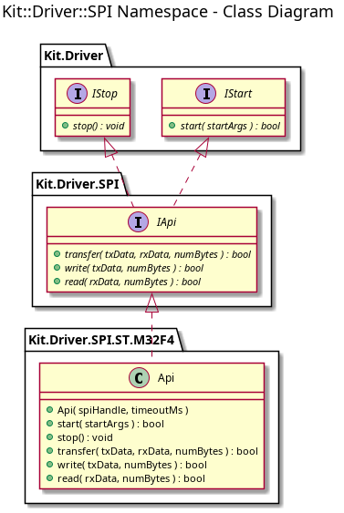

# Kit::Driver::NV::Flash
@brief namespace description for Kit::Driver::NV::Flash
@namespace Kit::Driver::NV::Flash @brief

The Flash namespace provides a concrete implementation of the NV::IApi
interface backed by SPI NOR flash storage.  The implementation features:

- Wear leveling via log-structured NV Record rotation
- In-memory page map for O(1) read lookup
- Read-modify-write to preserve unmodified bytes
- CRC32 integrity checking on record headers
- Global sequence numbering for write ordering
- Two-phase sector reclamation (scan-then-erase)

Supports configurable NV page sizes and total storage sizes.

## Class Diagrams

## Design Documentation

- [NV Flash Design - Terminology, Record Structure, and Sector Layout](nv-flash-illustration.md)
- [NV Flash Design Review Response - Address Mapping and Performance](nv-design-review-response.md)
