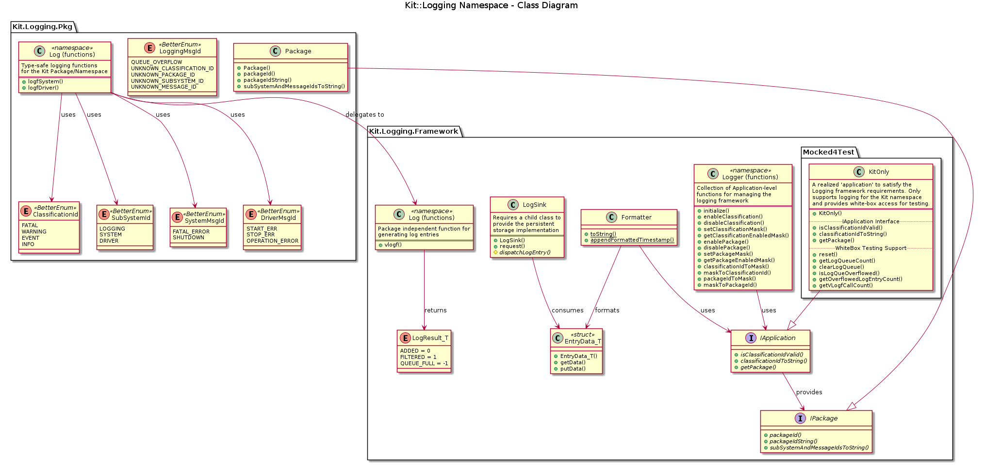

# Kit::Logging
@brief Namespace description for Kit::Logging
@namespace Kit::Logging @brief

The Logging namespace contains a logging framework as well as the Kit namespace
specific logging identifiers and methods.

See The Kit::Logging::Framework namespace for details of the KIT library's
approach to logging and its design.

See The Kit::Logging::Pkg namespace for details of the Kit namespace
specific log identifiers and methods.

## Class Diagram

Here is a simplified class diagram for the Logging framework
