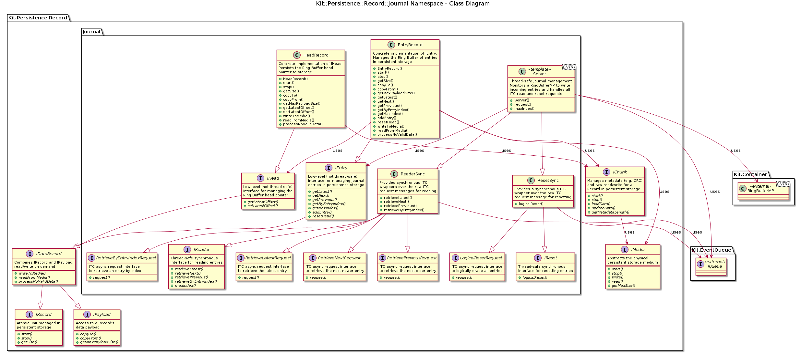

# Kit::Persistence::Record::Journal
@brief namespace description for Kit::Persistence::Record::Journal
@namespace Kit::Persistence::Record::Journal @brief

## Class Diagram

Here is a simplified class diagram for the Journal namespace

## Details

The 'Journal' namespace extends the basic Persistent::Record interface with the
ability for a single Record to contain N entries in chronological order, where
an entry content is defined by a Kit::Persistence::IPayload instance.  An example
usage for Journal entries is to persistently store log entries.

**NOTE**: The core implementation is **not** thread safe.  See the *Application
          Interfaces* section below for how clients/the-application safely
          read and write journal entries.

- A single IChunk handler is used for writing all N entries.

- For a given IEntry Record instance, all entries must be the same, fixed size.

- When traversing the list of entries and an corrupt entry is detected, the
  traversal logic will skip up to M consecutive corrupt entries before declaring
  a failure.

  - This provides a measure of fault tolerance if/when an individual entry
    gets corrupted in persistence storage (e.g. power loss while writing)

- The individual entries are logically stored in a Ring Buffer.  This means that
  once the Ring Buffer is full (i.e. all of the space available to the IMedia
  instance has been written to) - older entries are over written when there is
  request to write a new entry.  
  
  - A 'head record' (with its own chunk handler) is used to persistently store
    the 'head pointer' (aka the offset of the newest entry in the Ring Buffer).

    - NOTE: The 'head record' is wholly managed by the IEntry instance, i.e.
            the head record instance should NOT be directly added to the Record
            Server's list of records to manage.

    - It is recommended to use a `Mirrored` IChunk handler for the head record
      to provide protection against corrupting the head record if power fails
      during an update.

  - There is **no method** for erasing entries. There is no need for the
    application to 'manually' reset or clear the entries to 'make room' or 'free
    of space'. The 'latest' N entries are always guaranteed to be stored.  

    - If the application needs to 'erase' the entries - it must do it **outside**
      of the `Journal` interfaces (e.g delete the underlying file when using a
      `IMedia::FileAdapter`)

    - There is a 'logical erase' (i.e. the `resetHead()` method) that can be
      used to *abandon* all of the entries.  This method is cosmetic in that
      no entries are actually erased/removed.

- A 64 bit 'timestamp' is associated with each entry.  The timestamp value is a
  free running counter that is used to determine the **relative** age between
  entries.

  - The larger an timestamp value is, the newer the entry is.

- On-startup - only the "head record" is loaded into the RAM

## Application Interfaces

- For thread safety, the application interfaces with the Journal records using
  ITC messaging and model points.  This is so that the physical reading and
  writing of persistence storage can be done in separate or dedicated thread
  from the Application threads.

- For *reading* journal entries the application can use the `IReader` interface
  which provides synchronous ITC wrappers over the raw ITC Request messages defined
  in `IReaderRequest` header file. The application can bypass the `IReader`
  interface and directly use the `IReaderRequest` if true asynchronous semantics
  are required.

- For adding or appending journal entries the application uses a
  `Kit::Container::RingBufferMP` instance.  The `RingBufferMP` class is a thread
  safe Ring Buffer in RAM with an associated model point.  When the application
  adds to the Ring Buffer, the `Journal::Server` gets a change notification and
  then drains the Ring Buffer in the notification callback while executing the
  *persistence storage* thread.

  - **NOTE**: In addition to an ITC mechanism, the `RingBufferMP` also provides
    *buffering* with respect to writing entries to persistence storage, i.e. allows
    entries to be generated faster (for a short time anyway) then time it takes
    to store a entry in persistence storage.

- The *reset* operations on the journal entries the application can use the `IReset`
  interface which provides synchronous ITC wrappers over the raw ITC Request
  messages defined in `IResetRequest` header file. The application can bypass
  the `IReset` interface and directly use the `IResetRequest` if true asynchronous
  semantics are required.
